# EXCEL GRID SIMULATOR
This project simulates a Microsoft Excel-style grid rendered on Canvas using OOP and SOLID principles in TypeScript.

## Project Objective
The goal of this project is to build a scalable, Excel-like spreadsheet UI with a clean TypeScript architecture that supports canvas-based rendering, selection, editing, resizing, formulas, undo/redo, and summary calculations while keeping the design maintainable and performance-conscious.

## Installation and Running
1. Go to the [Github Repo](https://github.com/sde2868/TrainingProgram/) of this project.
2. Download ZIP file.
3. Extract it and open /GridSimulator/excel-grid
4. Open terminal and run
```bash
npm install
```
5. Run
```bash
npm run dev
```

## Features
1. Excel-like Grid view on Canvas with separate highlighting for selected cell(s) and active cell.
1. Headers for rows and column showing row-number and column-name.
1. Cell edit on double-click or direct typing (Ctrl+Enter to save).
1. Resizable rows and columns by drag-holding edges in header.
1. Word-wrap for long text in a cell.
1. Auto-fit / auto-resize for row if a cell invloves multiple line text.
1. Copy / paste content for a cell / range of selected cell(s) using <kbd>Ctrl</kbd>+<kbd>C</kbd> / <kbd>Ctrl</kbd>+<kbd>V</kbd> respectively.
1. Undo / redo command applicable on row / column resize, copy / paste content, edit cell using <kbd>Ctrl</kbd>+<kbd>Z</kbd> / <kbd>Ctrl</kbd>+<kbd>Y</kbd> respectively.
1. Vertical navigation using <kbd>Enter</kbd> key (<kbd>Enter</kbd> for ⬇️ and <kbd>Shift</kbd>+<kbd>Enter</kbd> for ⬆️).
1. Horizontal navigation using <kbd>Tab</kbd> key (<kbd>Tab</kbd> for ➡️ and <kbd>Shift</kbd>+<kbd>Tab</kbd> for ⬅️).
1. Navigation using `Arrow` (⬆️, ⬇️, ⬅️, ➡️) keys.
1. Select a single cell / row / column by tapping on cell / row-header / column-header respectively.
1. Select a range of cells using <kbd>Shift</kbd>+`Arrow` (⬆️, ⬇️, ⬅️, ➡️) keys.
1. Select a range of cells by drag-holding mouse.
1. Select all cells (entire spreadsheet) using <kbd>Ctrl</kbd>+<kbd>A</kbd> or clicking on the corner cell at the start of the spreadsheet.
1. Auto-scroll on mouse drag selection.
1. Status bar showing stats like count, sum, average for selected cell(s).
1. Directly formula typing in a cell (start with <kbd>=</kbd>). Types implemented:
    1. Simple formula involving individual cells. Example:
        ```
        =A1+A10
        ```
    1. Range formula (COUNT, SUM, AVERAGE, MIN, MAX) involving range of cells. Example:
        ```
        =SUM(A10:C35)
        ```
    1. Nested (recursive) formula. Example:
        ```
        =SUM(A10:C35)
        ```
        in F5 and
        ```
        =SUM(A11:C45)
        ```
        in F6 and
        ```
        =SUM(F5:F6)
        ```
        in G5
1. Auto update (recalculate) formula results on change in cell values.
1. Appropriate error handling for formulas including:
    1. `#NAME?` error for unidentified formula / incorrent usage of formula.
    1. `#REF!` error for incorrect refernce passed.
    1. `#CIRC!` error for circular referencing in nested formulas.
    1. `#DIV/0!` error for division by zero when using formulas like average and division.

## Folder Structure
```
.
├── README.md
└── excel-grid
    ├── index.html
    ├── package-lock.json
    ├── package.json
    ├── src
    │   ├── Clipboard
    │   │   └── ClipboardManager.ts
    │   ├── Commands
    │   │   ├── CellEdit.ts
    │   │   ├── Command.ts
    │   │   ├── CommandManager.ts
    │   │   ├── EditCellCommand.ts
    │   │   ├── MultiCellEditCommand.ts
    │   │   ├── ResizeColumnCommand.ts
    │   │   └── ResizeRowCommand.ts
    │   ├── Data
    │   │   └── DataStore.ts
    │   ├── Editor
    │   │   └── EditorManager.ts
    │   ├── Formula
    │   │   └── FormulaEngine.ts
    │   ├── Grid
    │   │   ├── Grid.ts
    │   │   ├── InputManager.ts
    │   │   ├── Renderer.ts
    │   │   ├── ResizeManager.ts
    │   │   ├── RowSizingManager.ts
    │   │   ├── ShortcutHandler.ts
    │   │   └── ViewportRenderer.ts
    │   ├── Models
    │   │   ├── Cell.ts
    │   │   ├── Column.ts
    │   │   └── Row.ts
    │   ├── Scroll
    │   │   └── ScrollManager.ts
    │   ├── Selection
    │   │   └── SelectionManager.ts
    │   ├── Stats
    │   │   ├── StatisticsManager.ts
    │   │   └── StatusBarManager.ts
    │   ├── main.ts
    │   └── style.css
    └── tsconfig.json
```

## Class Diagram
The project architecture is centered around a single `Grid` orchestration class and a set of supporting managers.

```mermaid
classDiagram
    class Grid {
        +render()
        +requestRender()
    }
    class DataStore {
        +setData(data)
        +getCell(row, column)
        +setCell(row, column, value)
        +getRowCount()
        +getColumnCount()
        +getCellValueByIndex(row, column)
        +setCellValueByIndex(row, column, value)
    }
    class SelectionManager {
        +startSelection(row, column)
        +updateSelection(row, column)
        +selectRow(row)
        +selectColumn(column)
        +selectAll()
        +getBounds(totalRows, totalColumns)
        +clearSelection()
    }
    class CommandManager {
        +execute(command)
        +undo()
        +redo()
    }
    class FormulaEngine {
        +evaluate(expression, dataStore, visited)
        +evaluateSum(range, dataStore, visited)
        +evaluateAverage(range, dataStore, visited)
        +evaluateMin(range, dataStore, visited)
        +evaluateMax(range, dataStore, visited)
    }
    class RowModel {
        +getHeight(row)
        +setHeight(row, height)
        +getIndex(y)
        +rebuildOffsets()
        +autoFitRowHeight(row, columnCount, getCellValue, getColumnWidth, measureText)
        +reAutoFitRows(columnCount, getCellValue, getColumnWidth, measureText)
    }
    class ColumnModel {
        +getWidth(column)
        +setWidth(column, width)
        +getIndex(x)
        +rebuildOffsets(headerWidth)
    }
    class ScrollManager {
        +getX()
        +getY()
        +setPosition(x, y)
        +scrollBy(dx, dy)
        +clamp(maxX, maxY)
        +ensureCellVisible(left, top, right, bottom, vw, vh, rowHeader, headerHeight)
        +updateAutoScroll(mouseX, mouseY, width, height, rowHeaderWidth, headerRowHeight)
    }
    class ClipboardManager {
        +copy(bounds, dataStore)
        +paste(activeRow, activeColumn, dataStore)
        +hasContent()
        +getContent()
        +setContent(text)
        +clear()
    }
    class EditorManager {
        +beginEdit(row, column, initialValue)
        +saveEdit()
        +cancelEdit()
        +isOpen()
    }
    class ResizeManager {
        +startColumnResize(column)
        +updateColumnResize(worldX)
        +finishColumnResize()
        +startRowResize(row)
        +updateRowResize(worldY)
        +finishRowResize()
    }
    class ShortcutHandler {
        +handleKeyDown(event, activeRow, activeColumn)
    }
    class InputManager {
        +handleMouseDown(event)
        +handleMouseMove(event)
        +handleMouseUp()
        +handleDoubleClick(event)
    }
    class StatusBarManager {
        +update()
    }
    class StatisticsManager {
        +calculateSelection(dataStore, selectionManager, rowModel, columnModel)
    }
    class Renderer {
        +fillRect(...)
        +drawText(...)
    }
    class ViewportRenderer {
        +render(activeRow, activeColumn)
    }
    class RowSizingManager {
        +autoFitRowHeight(row)
        +reAutoFitRows()
        +clearAutoFitRow(row)
    }
    class EditCellCommand {
        +execute()
        +undo()
    }
    class MultiCellEditCommand {
        +execute()
        +undo()
    }
    class ResizeColumnCommand {
        +execute()
        +undo()
    }
    class ResizeRowCommand {
        +execute()
        +undo()
    }

    Grid --> DataStore
    Grid --> SelectionManager
    Grid --> CommandManager
    Grid --> FormulaEngine
    Grid --> RowModel
    Grid --> ColumnModel
    Grid --> ScrollManager
    Grid --> ClipboardManager
    Grid --> EditorManager
    Grid --> ResizeManager
    Grid --> ShortcutHandler
    Grid --> InputManager
    Grid --> StatusBarManager
    Grid --> RowSizingManager
    Grid --> ViewportRenderer

    ViewportRenderer --> Renderer
    ViewportRenderer --> RowModel
    ViewportRenderer --> ColumnModel
    ViewportRenderer --> ScrollManager
    ViewportRenderer --> SelectionManager
    ViewportRenderer --> DataStore
    ViewportRenderer --> FormulaEngine

    RowSizingManager --> RowModel
    RowSizingManager --> DataStore
    RowSizingManager --> ColumnModel

    ShortcutHandler --> SelectionManager
    ShortcutHandler --> DataStore
    ShortcutHandler --> CommandManager
    ShortcutHandler --> ClipboardManager
    ShortcutHandler --> RowModel
    ShortcutHandler --> ColumnModel

    InputManager --> RowModel
    InputManager --> ColumnModel
    InputManager --> ScrollManager
    InputManager --> ResizeManager

    StatusBarManager --> StatisticsManager
    StatusBarManager --> DataStore
    StatusBarManager --> SelectionManager
    StatusBarManager --> RowModel
    StatusBarManager --> ColumnModel

    CommandManager o-- EditCellCommand
    CommandManager o-- MultiCellEditCommand
    CommandManager o-- ResizeColumnCommand
    CommandManager o-- ResizeRowCommand
```



## Design Notes and Architecture

### Data storage approach
The spreadsheet state is centered in `DataStore`, which keeps a base array of row-oriented records plus a sparse `Map` for cells that fall outside the initial schema. Rows and columns are represented by dedicated models, while cells are read and written by index through `getCell`/`setCell` and `getCellValueByIndex`/`setCellValueByIndex`. This allows the grid to store regular JSON data efficiently while also supporting dynamically created cells for editing, formulas, and extra coordinates without forcing every cell to exist in memory.

### Virtual rendering approach
Rendering is performed only for the visible viewport instead of the full sheet. `ViewportRenderer` calculates the first and last visible rows and columns using the current scroll offsets and canvas dimensions, then draws only those cells and headers. This makes the UI responsive for very large datasets because the renderer never needs to paint the entire 100,000 x 500 logical grid at once.

### Command pattern approach
All mutating actions are wrapped as commands and routed through `CommandManager`. Each command implements `execute()` and `undo()` so editing a cell, resizing a row, or resizing a column can be replayed or reversed consistently. The manager maintains separate undo and redo stacks, ensuring that actions can be undone in reverse order and redone in the same order they were originally performed.

### Selection model
Selection state is maintained by `SelectionManager` using a combination of selection type and start/end coordinates. The model distinguishes between a single active cell, a full row, a full column, a rectangular cell range, or the entire sheet (`all`). These bounds are then used by rendering, clipboard operations, and summary calculations so selection behavior remains consistent when the user scrolls or edits cells.

### Summary calculation
Summary values are calculated from the current selection bounds rather than scanning the entire dataset. `StatisticsManager` iterates only across the selected rows and columns, skips empty or invalid values, and computes `count`, `min`, `max`, `sum`, and `average` using numeric checks. This keeps the calculation lightweight while still ignoring non-numeric values safely.

### Performance observations
The canvas-based implementation is significantly more efficient than a DOM table for large grids because only the visible portion of the sheet is redrawn. Virtual rendering, bounded selection scans, and command-based state changes help keep interactions responsive during scrolling, editing, resizing, and summary updates. The main limitations are that the app still relies on in-memory data and that a canvas-based UI is less accessible than a native table or form-based control.

- `Grid`
  - orchestrates rendering, selection, input, editing, formula evaluation, commands, and status updates.
  - injects dependencies: `DataStore`, `SelectionManager`, `StatisticsManager`, `CommandManager`, `FormulaEngine`, `RowModel`, `ColumnModel`, `ScrollManager`, `ClipboardManager`, `EditorManager`, `ResizeManager`, `ShortcutHandler`, `InputManager`, `StatusBarManager`, `RowSizingManager`.

- `DataStore`
  - stores spreadsheet rows, columns, and non-schema cells.
  - provides row/column count, read/write by index, and dynamic cell growth.

- `SelectionManager`
  - tracks active cell, range selection, row selection, column selection, and select-all state.
  - computes selection bounds for statistics, copy/paste, and rendering.

- `CommandManager`
  - executes commands and maintains undo/redo stacks.
  - works with command implementations: `EditCellCommand`, `MultiCellEditCommand`, `ResizeColumnCommand`, `ResizeRowCommand`.

- `EditorManager`
  - controls edit mode and saves or cancels inline cell edits.
  - notifies `Grid` when a cell edit is committed so row auto-fit and rendering can update.

- `FormulaEngine`
  - evaluates formulas including references, SUM, AVERAGE, MIN, MAX, and circular reference detection.
  - resolves values from `DataStore` and handles formula errors like `#REF!`, `#CIRC!`, and `#DIV/0!`.

- `Renderer` and `ViewportRenderer`
  - `Renderer` provides low-level canvas drawing utilities.
  - `ViewportRenderer` calculates which rows and columns are visible and renders headers, cells, and selection overlays.

- `RowModel` and `ColumnModel`
  - maintain row heights, column widths, offsets, and index lookups.
  - support auto-fit heights and rebuild offsets after resizing.

- `ScrollManager`
  - tracks current scroll position and clamps scrolling to available content.
  - supports auto-scroll during drag selection and ensures active cells are visible.

- `ResizeManager`
  - manages interactive row/column resizing state, updating the corresponding model width/height.
  - returns command objects for undoable resize operations.

- `ShortcutHandler`
  - maps keyboard events to navigation, editing, clipboard, undo/redo, and selection actions.
  - delegates rendering, statistics, and active-cell movement through callback injections.

- `InputManager`
  - handles mouse interactions across grid areas: corner, header, and cells.
  - manages selection drag, header selection, resize behavior, double-click edit, and auto-scroll triggers.

- `StatusBarManager` and `StatisticsManager`
  - `StatisticsManager` computes numeric metrics for the current selection.
  - `StatusBarManager` formats those metrics and updates the DOM status labels.

## Application of OOP concepts
1. The project uses classes to represent real-world spreadsheet concepts such as rows, columns, cells, selection state, and rendering behavior.
1. Managers such as Grid, SelectionManager, EditorManager, ClipboardManager, and FormulaEngine encapsulate related responsibilities and keep the code organized.
1. Data is separated from presentation, with DataStore holding spreadsheet data while Renderer and ViewportRenderer handle drawing on the canvas.

## Application of SOLID concepts
1. Single Responsibility Principle is followed by giving each class a focused role, such as rendering, formula evaluation, selection handling, or command execution.
1. Open/Closed Principle is reflected in the command-based design, where new actions can be added by introducing new command classes without changing the manager logic.
1. Dependency Inversion is applied by injecting dependencies such as DataStore, SelectionManager, and FormulaEngine into the Grid and its subcomponents instead of hard-coding them.

## Application of Command Pattern
1. Editing a cell, resizing a row/column, and applying multi-cell paste actions are wrapped in command classes like EditCellCommand, ResizeRowCommand, ResizeColumnCommand, and MultiCellEditCommand.
1. Every command exposes execute() and undo() methods so state changes can be reversed consistently.
1. CommandManager centralizes the execution flow and maintains separate undo and redo stacks.

## Working of Undo / Redo
1. Every mutating action is first converted into a command object before being executed.
1. Undo pops the latest command from the undo stack and restores the previous state of the affected cell or dimension.
1. Redo replays the command from the redo stack after an undo, allowing users to recover the last reverted change.

## Working of Virtual Rendering
1. Only the visible portion of the sheet is painted, which makes the grid responsive even for a very large number of rows and columns.
1. RowModel and ColumnModel calculate offsets and sizes so the renderer can determine which rows and columns are currently in the viewport.
1. ViewportRenderer clips drawing to the visible area and renders only the cells, headers, and selection highlights that fall inside the current screen region.

## Data Generation and Loading
1. The app generates a synthetic dataset of 50,000 records in main.ts using a simple schema with fields such as firstName, lastName, age, and salary.
1. DataStore stores the generated records and derives the visible column names from the first item in the dataset.
1. The grid can dynamically update cell values, add new cells when needed, and recalculate formula-based outputs as the user edits the sheet.

## Manual Test Cases
1. Formula in cell
   - steps: enter a formula starting with `=` and press <kbd>Ctrl</kbd>+<kbd>Enter</kbd> or move focus to another cell.
   - expected: the cell displays the computed result; double clicking again opens edit mode showing the raw formula string.
1. Direct Cell edit from keyboard
   - steps: select a cell and type a character such as `a`.
   - expected: edit mode starts with the initial character, and leaving the cell commits the value.
1. Cancel edit with Escape
   - steps: begin editing a cell, modify its value, and press <kbd>Escape</kbd>.
   - expected: the edit cancels and the original value remains unchanged.
1. Arrow-key navigation
   - steps: select a cell and press <kbd>ArrowRight</kbd>, <kbd>ArrowDown</kbd>, <kbd>ArrowLeft</kbd>, <kbd>ArrowUp</kbd>.
   - expected: the active cell moves correctly in each direction.
1. Shift+arrow extends selection
   - steps: select a cell, hold <kbd>Shift</kbd>, and press arrow keys.
   - expected: the range selection expands from the starting cell.
1. Tab and Shift+Tab navigation
   - steps: select a cell and press <kbd>Tab</kbd> or <kbd>Shift</kbd>+<kbd>Tab</kbd>.
   - expected: the active cell moves one column right or left.
1. Enter and Shift+Enter navigation
   - steps: select a cell and press <kbd>Enter</kbd> or <kbd>Shift</kbd>+<kbd>Enter</kbd>.
   - expected: the active cell moves down or up one row.
1. Select all
   - steps: press <kbd>Ctrl</kbd>+<kbd>A</kbd> or click the top-left corner cell.
   - expected: every cell in the spreadsheet becomes selected.
1. Row selection
   - steps: click a row header.
   - expected: the full row is selected across all columns.
1. Column selection
   - steps: click a column header.
   - expected: the full column is selected across all rows.
1. Drag selection by mouse
   - steps: click and drag across cells to form a range.
   - expected: the rectangular selection updates as the mouse moves.
1. Copy selected range
   - steps: select a cell range and press <kbd>Ctrl</kbd>+<kbd>C</kbd>.
   - expected: the selected values are stored in the clipboard manager.
1. Paste copied block
   - steps: move to a target cell and press <kbd>Ctrl</kbd>+<kbd>V</kbd>.
   - expected: the copied cells paste into the target area with the correct layout.
1. Delete/backspace clears cell
   - steps: select a cell with content and press <kbd>Delete</kbd> or <kbd>Backspace</kbd>.
   - expected: the cell content is cleared and undo is available.
1. Undo edit
   - steps: make a cell edit and press <kbd>Ctrl</kbd>+<kbd>Z</kbd>.
   - expected: the previous value is restored.
1. Redo edit
   - steps: undo a change and press <kbd>Ctrl</kbd>+<kbd>Y</kbd> or <kbd>Ctrl</kbd>+<kbd>Shift</kbd>+<kbd>Z</kbd>.
   - expected: the undone change is reapplied.
1. Formula SUM calculation
   - steps: populate a numeric range and enter `=SUM(A1:A3)`.
   - expected: the cell shows the correct sum.
1. Formula AVERAGE with blanks
   - steps: build a range with numbers and blanks, enter `=AVERAGE(A1:A4)`.
   - expected: only numeric cells contribute to the average.
1. Formula MIN/MAX
   - steps: enter `=MIN(A1:A3)` and `=MAX(A1:A3)`.
   - expected: each formula returns the correct minimum or maximum value.
1. Circular reference detection
   - steps: create formulas that reference each other in a loop.
   - expected: the cell shows `#CIRC!`.
1. Invalid reference handling
   - steps: enter a formula with invalid addresses like `=A0` or `=ZZ9999`.
   - expected: the cell shows `#REF!`.
1. Auto-fit row height
   - steps: enter long wrapped text and trigger row auto-fit.
   - expected: the row height increases so the text is fully visible.
1. Column resize
   - steps: drag a column header edge.
   - expected: the column width updates and the grid redraws.
1. Row resize
   - steps: drag a row header edge.
   - expected: the row height updates and the grid redraws.
1. Auto-scroll during drag selection
   - steps: drag selection toward the viewport edge.
   - expected: the view auto-scrolls and the selection continues.
1. Status bar statistics
   - steps: select cells with numeric data.
   - expected: status bar shows correct count, sum, average, min, and max.

## Performance Observations
1. The canvas-based implementation performs better than a traditional DOM grid for very large datasets because it only renders what is visible.
1. Virtual rendering and requestAnimationFrame-based redraws reduce unnecessary work during scrolling and selection updates.
1. Copy operations are intentionally limited to avoid excessive memory use for very large selections.

## Accessibility Considerations
1. The spreadsheet is rendered on a canvas, so it does not provide native accessibility semantics like a real table or form control.
1. Keyboard shortcuts are available for editing and navigation, but the experience is less discoverable than a standard spreadsheet UI.
1. Future improvements could include better focus handling, screen-reader support, and more visible keyboard guidance.

## Known Limitations and Next Improvements
1. Implemented on Canvas which hampers accessibility.
1. Unavailability of scroll bar (both vertical and horizontal).
1. Impersistant data, currently uses in-memory storage.
1. Formula restricted by current implementation types, mixing formulas (simple + range), long arithmetic expressions and brackets not supported.
1. Status bar updates triggers after mousedown when selecting a range of cells using mouse drag-holding.
1. Performance optimizations for larger datasets.
1. Better clipboard using system clipboard.